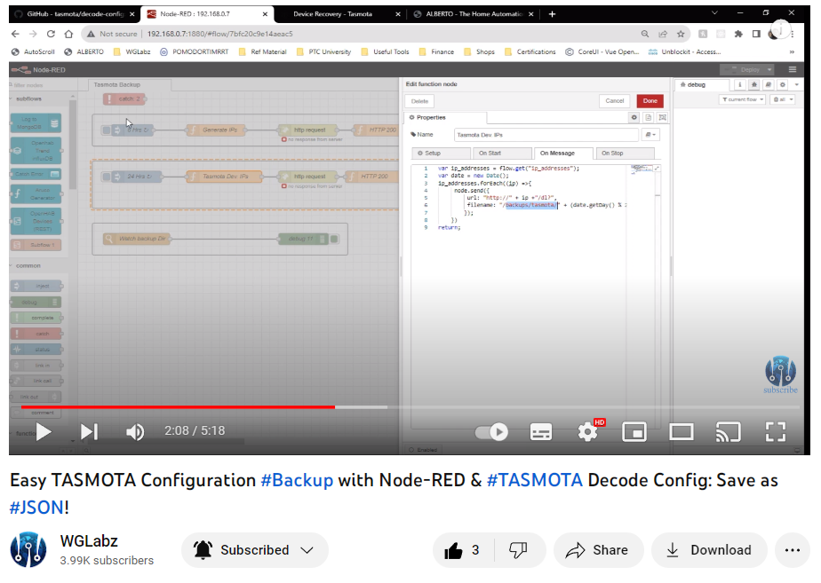

## TASMOTA Decode Config Docker

To use this project clone the repo and run `build.sh`. Make sure you have `docker` and `docker compose` installed.

```shell
$ ./build.sh
```

You can put the `.dmp` file backed  up from the TASMOTA device into `data/source` folder and that will create the corresponding JSON file in `data/output` directory.

> This project depends/uses [decode-config](https://github.com/tasmota/decode-config) repository
<br />

You can also checkout the complete video on this, 

<br />

<a href="https://bit.ly/3Q85tW4">

  
  
</a>
